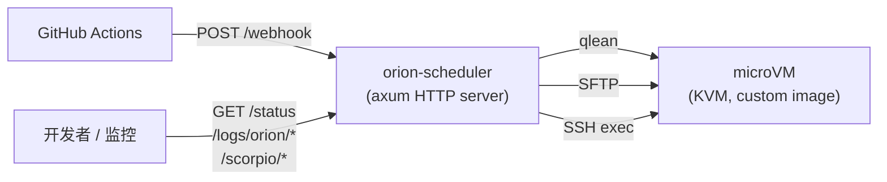
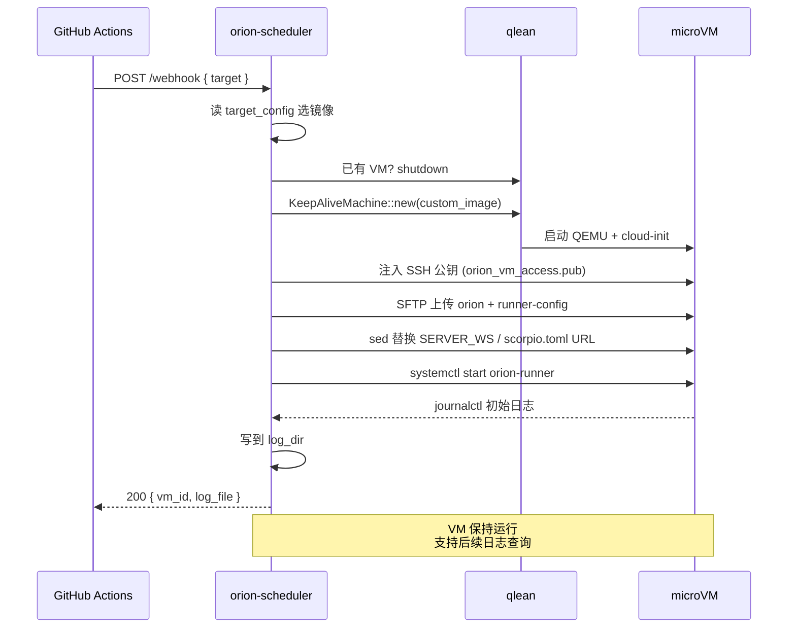

> **项目已迁移至 [mega/orion-scheduler](https://github.com/web3infra-foundation/mega/tree/main/orion-scheduler)**，此仓库已不再维护。

# Orion Scheduler

接收 GitHub Actions webhook 的常驻服务：用 [qlean](https://crates.io/crates/qlean) 拉起 QEMU/KVM microVM，把 Orion 二进制和 runner 配置 SFTP 进去，启动 `orion-runner` systemd 服务，并保持 VM 长期运行以便实时拉取日志。



---

## 快速开始

### 前置要求

| 项 | 要求 |
| --- | --- |
| CPU 虚拟化 | 启用 KVM；AWS EC2 需要支持嵌套虚拟化的实例（`C8i` / `M8i` / `R8i`），并在 CPU options 中打开 Nested virtualization |
| NBD 模块 | 构建自定义镜像时需要：`sudo modprobe nbd max_part=8` |
| Rust | 1.85+（项目使用 Rust 2024 edition） |
| 网络 | 主机需要 `qlbr0` 网桥；`/etc/qemu/bridge.conf` 中加 `allow qlbr0` |
| 镜像 | 已经构建好的 `debian-13-buck2.qcow2`（见[自定义镜像](#自定义镜像)） |

### 构建运行

```bash
cargo build --release

# 服务需要 root 才能 KVM/挂载/写日志目录
sudo ./target/release/orion-scheduler
```

开发模式直接 `sudo env "PATH=$PATH" cargo run`，保留环境变量给 cargo 找到 rustc/cargo home。

### 最小配置（`target_config.json`）

```json
{
  "log_dir": "/var/log/orion-scheduler",
  "targets": {
    "aws-gitmega": {
      "server_ws": "wss://orion.gitmega.com/ws",
      "scorpio_base_url": "https://git.gitmega.com",
      "scorpio_lfs_url": "https://git.gitmega.com"
    }
  }
}
```

可通过 `CONFIG_PATH` 环境变量改路径。

---

## 工作流程

`POST /webhook` 触发一次完整的部署：



具体见 [`src/orion_deployer.rs`](src/orion_deployer.rs) 的 `handle_update`。

---

## API 端点

| 方法 | 路径 | 说明 | 响应 |
| --- | --- | --- | --- |
| GET | `/health` | 服务健康检查 | `{ "status": "healthy", ... }` |
| GET | `/webhook` | webhook 端点连通性检查 | `{ "status": "ok", "vm_id": null, ... }` |
| POST | `/webhook` | 触发部署，body 见下方详情 | `{ "status": "ok", "vm_id", "orion_log_file" }` |
| GET | `/status` | 当前 VM 状态 | `{ "status": "running"\|"no_vm", vm_id, vm_ip, uptime_secs }` |
| GET | `/logs/orion/stream` | SSE 流，每 2 秒推送新增日志 | `text/event-stream` |
| GET | `/scorpio/status` | Scorpio FUSE 挂载点、目录、进程状态 | JSON |
| GET | `/scorpio/config` | 直接读 VM 内 `/home/orion/orion-runner/scorpio.toml` | `{ "path", "content" }` |
| POST | `/shutdown` | 只关 VM，服务保持运行 | `{ "status": "ok", "message" }` |

### POST /webhook 示例

```bash
curl -X POST http://localhost:8080/webhook \
  -H 'Content-Type: application/json' \
  -d '{"target": "aws-gitmega"}'
```

| 字段 | 类型 | 必填 | 说明 |
| --- | --- | --- | --- |
| `target` | string | 是 | 必须在 `target_config.json` 的 `targets` 里存在 |
| `action` | string | 否 | GitHub Actions event type，仅记日志 |
| `image_path` | string | 否 | 本地 qcow2 路径（覆盖 `default_image`） |
| `image_url` | string | 否 | 远程 HTTPS URL（覆盖 `default_image`） |
| `image_digest` | string | 否 | 镜像 SHA256/SHA512 hash，`image_path`/`image_url` 存在时必填 |
| `image_disk_gb` | u32 | 否 | VM 磁盘大小（GB） |
| `image_cpus` | u32 | 否 | vCPU 数 |
| `image_memory_mb` | u32 | 否 | 内存 MB |

> `image_path` 和 `image_url` 互斥，不能同时设置。提供了镜像参数时 `image_digest` 必须提供（格式：`sha256:...` 或 `sha512:...`）。资源参数（`image_disk_gb`、`image_cpus`、`image_memory_mb`）未提供时使用默认值（disk: 镜像内建大小，cpus: 4，memory: 8192MB）。

---

## 自定义镜像

VM 启动时间和部署延迟主要取决于镜像里有没有预装 Rust/buck2/apt 包。`scripts/build-custom-image.sh` 用纯 chroot 把工具链直接写进镜像，**不启动 VM**，构建只要 5 分钟左右。

### 一键构建

```bash
sudo modprobe nbd max_part=8
sudo bash scripts/build-custom-image.sh
```

脚本会自动：

1. 复制 `debian-13-generic-amd64.qcow2` 基础镜像并 resize 到 15GB
2. 通过 `qemu-nbd` 挂载、`growpart` + `resize2fs` 扩展分区
3. chroot 进镜像安装：
   - Rust 1.95.0 toolchain（host 上预下载 tarball，避免 chroot DNS 问题）
   - apt 包：`clang lld pkg-config protobuf-compiler zstd fuse curl git seccomp libseccomp-dev libpython3-dev openssl libssl-dev build-essential`
   - buck2 (`2026-04-15` 版本)
   - SSH 公钥写入 `/root/.ssh/authorized_keys`
   - 软链 `rustc` / `cargo` → `/usr/local/bin/`，确保默认 PATH 能找到
4. chroot 末尾 `dd` 写满空闲块再删除，便于压缩
5. `qemu-img convert -O qcow2 -c` 压缩（**15GB → ~1.2GB**，省 90%+）
6. 发布到 qlean 期望的扁平路径：`~/.local/share/qlean/images/debian-13-buck2.qcow2`，并更新 `debian-13-buck2.json` 里的 sha256 digest

### 安全特性

| 特性 | 实现 |
| --- | --- |
| 失败自动清理 | `trap cleanup EXIT INT TERM HUP` 卸载 bind mounts + 断开 NBD |
| 严格错误捕获 | `set -eo pipefail`，chroot 内任何步骤失败立即中止 |
| 锁检测 | publish 前用 `qemu-img info` 探测目标文件，若被运行中的 VM 占用则跳过覆盖 |
| 设备同步 | 用 `udevadm settle` + 轮询代替固定 `sleep` |

### 预装内容速查

| 组件 | 版本 | 位置 |
| --- | --- | --- |
| Rust | 1.95.0 | `/root/.cargo/bin/`，软链到 `/usr/local/bin/` |
| buck2 | 2026-04-15 | `/usr/local/bin/buck2` |
| clang / lld | 19.x | apt 系统路径 |
| git / protoc / zstd / openssl | apt 当前版本 | 系统路径 |
| SSH key | `~/.ssh/orion_vm_access.pub` | `/root/.ssh/authorized_keys` |

---

## 配置说明

完整 schema 在 [`DESIGN.md`](DESIGN.md) 第 5 节，下面只列常用字段。

### 顶层字段

| 字段 | 类型 | 默认 | 说明 |
| --- | --- | --- | --- |
| `log_dir` | string | `/var/log/orion-scheduler` | Orion 启动期日志落盘目录 |
| `targets` | map | `{}` | 部署目标定义，至少一项 |
| `cpus` | u32? | vCPU 数，默认 4 |
| `memory_mb` | u32? | 内存 MB，默认 8192 |

> **注意**：`path` 和 `url` 互斥，不能同时设置。提供了 `url` 时 qlean 会自动从远程下载；提供了 `path` 时使用本地已有镜像。`digest` 两种情况都必须提供。

### `targets[name]`

| 字段 | 类型 | 说明 |
| --- | --- | --- |
| `server_ws` | string | Orion WebSocket URL，写入 VM 内 `.env` 的 `SERVER_WS` |
| `scorpio_base_url` | string | 写入 `scorpio.toml` 的 `base_url` |
| `scorpio_lfs_url` | string | 写入 `scorpio.toml` 的 `lfs_url` |

### 内置 target（[`target_config.json`](target_config.json) 默认）

| target | SERVER_WS | scorpio base_url |
| --- | --- | --- |
| `aws-gitmega` | `wss://orion.gitmega.com/ws` | `https://git.gitmega.com` |
| `aws-gitmono` | `wss://orion.gitmono.com/ws` | `https://git.gitmono.com` |
| `gcp-buck2hub` | `wss://orion.buck2hub.com/ws` | `https://git.buck2hub.com` |

---

## 目录结构

```text
orion-scheduler/
├── src/
│   ├── main.rs                # axum 入口 + 信号处理
│   ├── handlers.rs            # 10 个 HTTP endpoint + 日志格式化
│   ├── state.rs               # AppState：VM info + KeepAliveMachine
│   ├── config.rs              # 读取/解析 target_config.json
│   ├── keep_alive.rs          # qlean::Machine 持久化包装
│   ├── orion_deployer.rs      # handle_update 编排（webhook 主流程）
│   └── vm_manager.rs          # SFTP 上传、sed 环境变量替换、systemctl 启停
├── scripts/
│   └── build-custom-image.sh  # chroot 离线预装 + qcow2 压缩 + publish
├── .github/workflows/
│   └── build-custom-image.yml # 镜像 CI（手动触发，上传 S3）
├── target_config.json         # 运行时配置
├── README.md                  # 本文档
├── DESIGN.md                  # 详细设计、生命周期、配置 schema
├── TESTING.md                 # 调试方法、API 测试、常见问题
└── ARTIFACT.md                # 产物分发演进方案（Action + S3 pull）
```

---

## 信号 & 环境变量

| 信号 / 动作 | VM | 服务进程 | 说明 |
| --- | --- | --- | --- |
| `Ctrl+C` / SIGINT | 关闭 | 退出 | 优雅关闭 |
| SIGTERM | 关闭 | 退出 | 同上 |
| SIGQUIT | 关闭 | 退出 | 同上 |
| `POST /shutdown` | 关闭 | **保持运行** | 只回收 VM |
| `pkill -9 orion-scheduler` | 残留 | 强杀 | 不优雅，VM 会变孤儿，需 `sudo pkill -9 qemu-system-x86` 清理 |

| 环境变量 | 默认 | 说明 |
| --- | --- | --- |
| `CONFIG_PATH` | `target_config.json` | 配置文件路径 |
| `RUST_LOG` | `info` | tracing 日志级别，常用 `debug` |

---

## 调试 & SSH 进 VM

部署完后从 `/status` 拿 `vm_ip`，用脚本预装的 SSH key 登录：

```bash
ssh -i /home/ubuntu/.ssh/orion_vm_access root@<vm_ip>
```

完整调试流程见 [`TESTING.md`](TESTING.md)。

---

## 演进方向

当前 `orion` 二进制和镜像都是从**本地路径**拷贝/读取的——见 [`src/orion_deployer.rs:61`](src/orion_deployer.rs) 的 `/home/ubuntu/mega/target/debug/orion`，以及 `target_config.json` 里的本地 qcow2 路径。

这要求 orion-scheduler 必须和 mega 源码、镜像构建产物在**同一台机器**。下一步会改成：

- mega 仓库的 GitHub Action 构建 release 版二进制 → 推 S3（带 sha 版本化 + `latest.json` manifest）
- 镜像构建 Action 上传 S3 + manifest，host 端复用 qlean 内置的 HTTPS 拉取 + sha 校验
- orion-scheduler 每次 webhook 按 manifest 拉最新，本地 cache 命中跳过下载

完整设计见 [`ARTIFACT.md`](ARTIFACT.md)。
